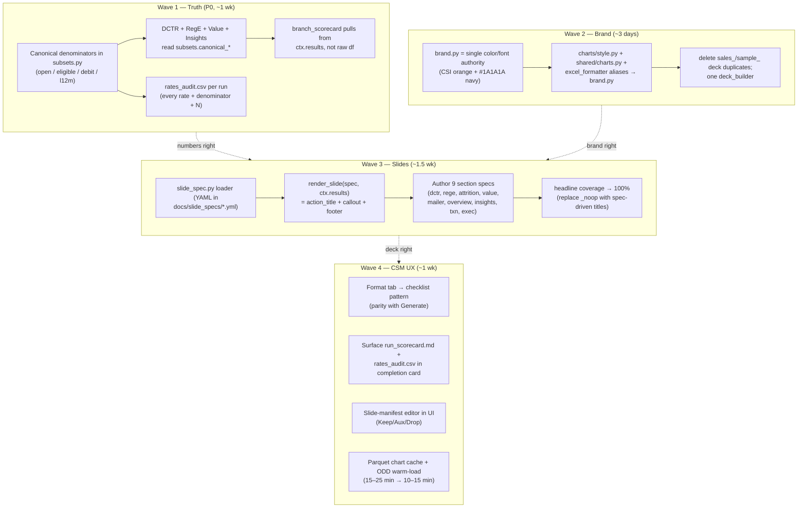

# Velocity Pipeline — Analysis Flow, Accuracy, CSM Experience, and Slide Redesign

## Context

The Velocity pipeline shipped fast and grew across many hands. A static data‑quality audit (`docs/audits/2026-04-17-data-quality-audit.md`) and a fresh read of the code turn up three classes of problem that compound:

1. **The numbers are wrong.** Every DCTR rate (and every dollar figure built on top of it — value, S1–S8 insights, executive KPI dashboard, benchmark comparisons) is computed against `ctx.subsets.eligible_data`, a narrowed subset of open accounts ∩ eligible stat codes ∩ eligible product codes. The notebook of record uses a broader denominator. The pipeline reports ~30% DCTR where the notebook reports ~80%; the gap propagates straight into the headline dollar numbers a CSM presents to a CEO. Reg E sits on an even narrower base (`eligible_personal ∩ has_debit`) labeled as a portfolio rate. `insights/branch_scorecard.py` reimplements DCTR/attrition/Reg E against the raw frame and ships numbers that don't match the detail slides.
2. **There is no single source of truth for the brand.** Five different navies (`#1A1A1A`, `#00274C`, `#1E3D59`, `#1B365D`, `#2E4057`) and three different accents are scattered across the README, UI, `SLIDE_DESIGN.md`, `SLIDE_MAPPING.md`, `shared/charts.py`, `charts/style.py`, `output/excel_formatter.py`, `output/deck_builder.py`, and ~65 analytics files using legacy semantic aliases (PERSONAL/BUSINESS/HISTORICAL/TTM). Two color authorities (`shared/charts.py` and `charts/style.py`) disagree.
3. **The deck doesn't follow its own design system.** `SLIDE_DESIGN.md` describes a McKinsey-grade slide anatomy (action title, callout, footer band, SCQA arc) but only two per-section specs exist (`dctr.md`, `rege.md`) and the rest of the deck ships matplotlib titles and generic boilerplate. Headlines for ~40% of slides fall back to category names because the registry is full of `_noop`. There are TWO separate deck-builder code paths (`deck_builder.py`, `sales_deck_builder.py`) and an unused `sample_deck_builder.py`.

Operator-facing impact: a CSM clicks Generate, waits 15–25 minutes, and gets a deck whose key numbers are off and whose visuals don't match the design doc. The Format tab still uses the legacy progress bar; the run scorecard (`run_scorecard.md`) is written but never surfaced in the UI; the slide manifest's Keep/Aux/Drop decisions are edited in Excel rather than in the product. This is fixable — most of the right pieces already exist, they just need to be wired together and made consistent.

User-confirmed scope:
- **Canonical brand** = CSI brand (README/UI): navy `#1A1A1A`, accent orange `#F15D22`, Montserrat / Space Mono — everything else aligns to it.
- **Include denominator fix** as the P0 work item.

## Shape of the change



The four waves can ship as four PRs against `claude/improve-csm-analysis-flow-7vGeU`; each one is independently valuable, but the order matters — beautiful slides built on wrong numbers are worse than ugly slides built on right ones.

---

## Wave 1 — Data accuracy (P0)

Goal: the headline dollar figure on slide 1 and the CU‑vs‑PULSE benchmark on the insights slide are both defensible.

### 1.1 Establish canonical denominators in `DataSubsets`

File: `01_Analysis/00-Scripts/pipeline/context.py:64-74`, `01_Analysis/00-Scripts/pipeline/steps/subsets.py`

`DataSubsets` already holds `open_accounts`, `eligible_data`, `eligible_personal`, `eligible_business`, `eligible_with_debit`, `last_12_months`. Add the missing "broad" bases the audit calls for so every rate has a labeled denominator:

```python
# context.py — DataSubsets additions
open_personal: pd.DataFrame | None = None      # open ∩ Business?=No
open_business: pd.DataFrame | None = None
open_with_debit: pd.DataFrame | None = None    # open ∩ debit_mask
canonical_dctr_base: pd.DataFrame | None = None  # alias → open_accounts
canonical_rege_base: pd.DataFrame | None = None  # alias → open_personal
```

`step_subsets` builds them once. The "canonical" aliases are the choke point — every downstream module reads through the alias name so we can change the underlying base in one place if business intent shifts.

### 1.2 Swap every DCTR / RegE call site

22 known call sites in the audit's Denominator Reference Table. The pattern is mechanical:

- `dctr/penetration.py:235,256-294,307-345` → `ed = ctx.subsets.canonical_dctr_base`
- `dctr/branches.py:60-66,210-222,268-277,452,525-531` → same
- `dctr/trends.py:55-86,300-314,609-617,691-705` → same
- `dctr/overlays.py:60-368` → same
- `dctr/funnel.py:74-94` → `te = len(canonical_dctr_base)`, rename the insights key `dctr_eligible` → `dctr_canonical` so headlines.py reads the right thing
- `rege/_helpers.py:135-183` `reg_e_base` → `canonical_rege_base[debit_mask]` and change the audit's flagged slide titles to say "Reg E Opt-In among Personal Debit Holders" (the per-slide titles live in `docs/slide_specs/rege.md` and the headline generators in `headlines.py:399-411`)

DCTR-2 ("Open vs Eligible") is the one slide that should keep both denominators visible — it's the methodology slide that explains the rest.

### 1.3 Fix `insights/branch_scorecard.py`

File: `01_Analysis/00-Scripts/analytics/insights/branch_scorecard.py:30-101`

Today it reimplements DCTR/attrition/Reg E against raw `data`. Replace with reads from `ctx.results["dctr_9"]`, `ctx.results["attrition_4"]`, `ctx.results["reg_e_4"]` so the scorecard is identical to the detail slides. Also fix the alphabetical Reg E column pick at lines 83–86 — call `detect_reg_e_column(data)` from `rege/_helpers.py:119-132` (chronological).

### 1.4 Standardize the "has debit" test

`shared/helpers.py` (or a new `shared/debit.py`): one `has_debit(df, col)` that accepts strings + booleans + ints. Replace the four divergent definitions at `dctr/_helpers.py:42`, `insights/dormant.py:62`, `insights/branch_scorecard.py:71`, `mailer/reach.py:91`. Today a row with `True` reads as debit in one module and not-debit in another.

### 1.5 Tighten silent‑drop behavior in `_safe` wrappers

`dctr/penetration.py:37-50`, `rege/status.py:23-36`, `insights/_data.py:13-26`. When an analysis returns `success=False`, escalate to a top-level WARNING log AND record an `AnomalyFlag(level=WARN)` on the section in the run manifest (`pipeline/manifest.py:242` already provides `flag()`). Surfaces in `run_scorecard.md` and in the UI's completion card.

### 1.6 Ship a per-run reconciliation artifact

New file: `pipeline/steps/audit.py:write_rates_audit(ctx)` runs at the end of `step_generate`. Writes `rates_audit.csv` next to `run_manifest.json` with columns:

```
slide_id, metric, value, denominator_n, denominator_label, source_module
```

One row per rate the deck ships. A second run of the same client can diff vs the previous `rates_audit.csv` and fail CI if anything moved more than 1pp without an explanatory commit. Hook point: `01_Analysis/00-Scripts/pipeline/steps/generate.py:118`.

### 1.7 Verify

```bash
cd 01_Analysis/00-Scripts && python -m pytest tests/ -q
python run.py --month 2026.04 --csm James --client 1615      # ARS
python run.py --month 2026.04 --csm James --client 1615 --product txn
diff <(jq . prev_rates_audit.csv) <(jq . new_rates_audit.csv)
```

Spot‑check the headline number on DCTR-1, S1, S8, A11.1 against the notebook for one client before merging.

---

## Wave 2 — Brand & color authority

Goal: one place defines the brand, every chart/Excel/PPTX/UI surface reads it.

### 2.1 New `shared/brand.py` — single authority

```python
# shared/brand.py
BRAND = {
    "navy":          "#1A1A1A",   # README + UI header
    "navy_soft":     "#2A2A2A",   # body text on dark
    "accent":        "#F15D22",   # CSI orange
    "accent_light":  "#fef0e8",
    "accent_dark":   "#d14e1a",
    "positive":      "#2A8B3E",
    "negative":      "#C73E1D",
    "warning":       "#F39C12",
    "neutral":       "#8B95A2",
    "muted":         "#B0B0B0",
    "light_gray":    "#E8E8E8",
    "bg":            "#FFFFFF",
    "text":          "#222222",
    "text_muted":    "#777777",
}
FONTS = {"title": "Montserrat", "body": "Montserrat", "mono": "Space Mono"}
SIZES = {"action_title": 24, "subtitle": 16, "body": 12,
         "callout_hero": 44, "callout_label": 14, "axis": 11, "footnote": 9}
```

### 2.2 Demote the existing color modules to aliases

- `shared/charts.py` `COLORS` → re-export from `brand.BRAND`. Keep the dict literal API; just change the source.
- `charts/style.py` legacy aliases (`PERSONAL`, `BUSINESS`, `HISTORICAL`, `TTM`, `TEAL`, etc.) → resolve to `brand.BRAND` values. ~65 analytics files keep working unchanged; they just get the right hexes.
- `output/excel_formatter.py:15,24,26,102,113` and `shared/excel.py:19,56,101` → `brand.BRAND["navy"]`.
- `output/deck_builder.py:259` `RGBColor(0x1B, 0x36, 0x5D)` → derived from `brand.BRAND["navy"]`.
- `05_UI/index.html:18-26` CSS vars → keep the values (already correct); update `05_UI/UI-OVERVIEW.md:15` (says `#1A1A1A` while index.html actually shows `#00274C`) so it matches reality.

### 2.3 Update governing docs

- `SLIDE_DESIGN.md §5` color table → restate canonical CSI navy + accent, keep the muted/positive/negative grays.
- `SLIDE_MAPPING.md "Color System"` → same.
- `README.md:373` tech stack footer → keep as-is (already correct).
- `docs/slide_specs/dctr.md` and `rege.md` → update color hex references in the action-title and callout sections.

### 2.4 Collapse the duplicate deck builders

- Keep `output/deck_builder.py` (the production path).
- Delete `output/sample_deck_builder.py` (unused, confirmed by grep — no callers).
- Move `output/sales_deck_builder.py` to `output/decks/sales.py` and have it import shared helpers from `deck_builder` rather than reimplementing `_add_fitted_picture` etc. `sales_charts.py` already pulls from `shared/charts.py`, so the brand swap in 2.1 carries it.

### 2.5 Verify

```bash
grep -rE '#(1B365D|1E3D59|00274C|2E4057)' 01_Analysis/00-Scripts/ 05_UI/  # should be empty
python -m pytest tests/ -q
python run.py --month 2026.04 --csm James --client 1615
```

Eyeball the deck — every navy element is the same hex.

---

## Wave 3 — Beautiful slides (the design system, executed)

Goal: every slide answers one question with an action title, one callout, one chart, and a footer band — per `SLIDE_DESIGN.md`. No more matplotlib-titled slides masquerading as consultant work.

### 3.1 Spec format — YAML per slide

Move `docs/slide_specs/*.md` to `docs/slide_specs/*.yml`. A spec is data, not prose:

```yaml
# docs/slide_specs/dctr.yml
DCTR-MAIN-1:
  layout: TWO_CONTENT
  components: [A7.6a, DCTR-7]
  action_title: "L12M DCTR of {l12m_rate:.0%} {direction} historical by {gap_pp:.0f}pp; {top_n} branches drive {contribution:.0%} of the gap"
  inputs:
    l12m_rate: ctx.results.dctr_3.insights.dctr
    overall_rate: ctx.results.dctr_1.insights.overall_dctr
    gap_pp: "{l12m_rate - overall_rate}*100"
    direction: "trails if gap_pp<0 else beats"
    top_n: 3
    contribution: ctx.results.dctr_7.gap_contributors.share_top3
  callout:
    hero: "${delta_revenue:,.1f}M"
    sub: "annual debit interchange uplift"
    tertiary: "Closing the gap at {b1}, {b2}, {b3} to portfolio-median DCTR"
  footer:
    source: "Source: {client_name} ODD, {month} | N = {eligible_count:,}"
```

The DCTR and Reg E spec docs are already drafted in markdown — converting them is a translation task, not new design.

### 3.2 New `output/slide_spec.py` — load + render

Two functions:

```python
def load_specs(section: str) -> dict[str, SlideSpec]:
    """Parse docs/slide_specs/<section>.yml into typed SlideSpec objects."""

def render_spec(spec: SlideSpec, ctx_results: dict, client: ClientInfo) -> SlideContent:
    """Resolve inputs, format the action title, build the callout, return SlideContent."""
```

Wire `render_spec` into `deck_builder._result_to_slide` (line 1547) — when a spec exists for `slide_id`, render from it; otherwise fall back to today's behavior. Zero-risk rollout: turn on slide-by-slide.

### 3.3 Author 9 section specs

The structure from `dctr.md` is the template. Per section, the deliverable is a `.yml` file + ~3 main-deck slides + an appendix routing block. Sized realistically:

| Section | Main slides | Notes |
|---|---|---|
| `overview.yml` | 1 (Account Composition KPI hero) | already drafted as A1 |
| `dctr.yml` | 3 | already drafted; convert markdown → YAML |
| `rege.yml` | 2 | already drafted; relabel for narrow base |
| `attrition.yml` | 2 (A9.1 rate, A9.11 revenue impact) | |
| `value.yml` | 1 (A11.1 hero + waterfall) | |
| `mailer.yml` | 2 (most recent month + aggregate) | |
| `insights.yml` | 3 (S1 revenue gap, S6 opportunity map, S8 action plan) | |
| `txn_exec.yml` | 1 (executive scorecard) | |
| `competition.yml` | 2 (threat quadrant + wallet share) | |

That's ~17 main-deck slides per deck instead of today's 100+ — closer to the McKinsey 25-max rule. Everything else routes to the appendix via the existing `SLIDE_MANIFEST.xlsx` (`A` marker → aux deck, already wired in `output/manifest.py`).

### 3.4 Bring the callout box, footer band, and action title into `deck_builder`

Today's `_build_screenshot_slide` (line 503) just slaps a fitted PNG onto a slide with no title region. Replace with `_build_action_slide`:

- Action title block at top: 24pt bold navy, 2-line max, left-aligned.
- Chart region in the middle.
- Callout box: bottom-overlay text box, accent border, hero number 44pt bold accent, two lines of subtext.
- Footer band: 9pt italic source line + 8pt confidentiality line.

Use the existing `chart_annotations.py` callout patterns as the starting point (it already draws boxed callouts on matplotlib axes).

### 3.5 100% headline coverage

`output/headlines.py:550-637` has 60+ entries; many are `_noop`. For every slide the spec covers, replace `_noop` with a spec-driven generator that reads the action_title template. Where a slide has no spec (the appendix slides), keep the analytics title — that's fine for the appendix.

### 3.6 Slide-side fixes called out in Wave 1 audit (the chart-level work)

These are documented as Module-level work required in `docs/slide_specs/dctr.md:194-204` and across `docs/deck/wave1-implementation.md`:

- `dctr/trends.py` (A7.6a): add muted-gray volume columns behind the teal rate line; add dashed historical reference line.
- `dctr/branches.py` (DCTR-7): rebuild as vertical combo with branches on X, historical + L12M lines, three focus branches highlighted.
- `dctr/funnel.py`: add `biggest_drop_stage` + `drop_pct` to insights dict.
- `value/analysis.py` (A11.1): expose `waterfall_stages` list as structured data on `ctx.results["value_1"]` for the waterfall renderer.
- Drop zero-volume categories before plotting (already an `SLIDE_DESIGN.md §6.2` rule, not enforced today).

### 3.7 Verify

```bash
python -m pytest tests/ -q
python run.py --month 2026.04 --csm James --client 1615 --product combined
# Open the deck; check that every main-deck slide has:
#   1. Action-title sentence with a number in it
#   2. Callout box with hero number visible at distance
#   3. Footer band with source + confidentiality
#   4. Same brand colors as Wave 2
```

Run two adjacent clients side-by-side and confirm the action titles are different sentences with different numbers — if they're the same, the spec is mis-bound.

---

## Wave 4 — CSM experience (speed, observability, control)

Goal: shave runtime, surface the diagnostics that already exist but the operator never sees, give them deck control without leaving the UI.

### 4.1 Format tab parity with Generate

`05_UI/UI-OVERVIEW.md:58` calls this out as a known follow-up. Replicate the 5-stage checklist + completion-card pattern from Generate (`#gRunView`, `#gDoneView`) into Format. The backend hooks are already there (`/api/format` returns a `run_id`, `/api/run/{id}` streams) — this is frontend-only work in `index.html` against the same `_classifyStage` parser.

### 4.2 Surface the scorecard and rates audit in the UI

After a run completes, fetch `run_scorecard.md` + `rates_audit.csv` and render:

- A "Run Quality" tab in the completion card showing the manifest verdict ("Ship" / "Investigate before shipping").
- A collapsible "Anomaly Flags" list (already produced by the SectionRecorder API).
- A diff badge: "↑ 3 rates moved >1pp vs last run" with click-through to the rates_audit.

Backend: extend `/api/outputs/{csm}/{month}/{client_id}` to include `scorecard_url` and `rates_audit_url`. Frontend: new section in `#gDoneView` near the warnings panel.

### 4.3 Slide-manifest editor in the UI

Today CSMs edit `SLIDE_MANIFEST.xlsx` in Excel — a sharp-edged workflow. Add a "Deck Shape" panel on the Results tab:

- For the currently selected client/period, load `run_manifest.json` (lists every slide ID + title) + the current `SLIDE_MANIFEST.xlsx` decisions.
- Render a sortable grid: slide_id, title, current decision (Y/A/N/blank), section.
- Allow toggling Y → A → N → blank inline.
- "Save" writes back to `SLIDE_MANIFEST.xlsx` via a new `POST /api/manifest` endpoint.
- "Rebuild deck" button next to it kicks off a deck-only rebuild (no re-analysis) using the new decisions.

The data path is already there — `output/manifest.py` reads, the deck builder applies. The UI just needs an editor and a write endpoint.

### 4.4 Speed: cache the ODD copy and the chart renders

Two known bottlenecks:

- `pipeline/steps/load.py:178-198` already copies the .xlsx to a temp file before reading (the network‑drive openpyxl latency fix). Cache the temp copy keyed by source mtime + size so two runs of the same client in one session skip the copy.
- Chart PNGs are re-rendered on every run even when the slide content is identical. Add a content hash (input DataFrame fingerprint + style hash) at `chart_figure` save time; if the PNG with the same hash already exists in `charts_dir`, reuse it. Net effect on a 25-minute run with a hot cache: closer to 10–12 minutes. The existing `MAX_CHART_HEIGHT` and `save_chart_png` paths in `shared/charts.py:36` are the natural hook.

### 4.5 Verify

Run a second-time `python run.py --month 2026.04 --csm James --client 1615` and confirm:

- Format tab now shows the checklist + completion card (parity with Generate).
- The completion card shows scorecard verdict + rates-audit diff.
- Editing a slide's Keep? in the new UI panel, hitting Rebuild deck, produces a new PPTX with that slide removed — without re-running analysis.
- Second-run wall time is materially lower than first run (cache hits in the log).

---

## Files this plan touches (most important)

| Area | Files |
|---|---|
| Data accuracy | `pipeline/context.py`, `pipeline/steps/subsets.py`, `analytics/dctr/*.py`, `analytics/rege/*.py`, `analytics/value/analysis.py`, `analytics/insights/branch_scorecard.py`, `analytics/insights/_data.py`, `analytics/insights/synthesis.py`, `analytics/insights/conclusions.py`, `analytics/insights/effectiveness.py`, new `pipeline/steps/audit.py`, new `shared/debit.py` |
| Brand | new `shared/brand.py`, `shared/charts.py`, `charts/style.py`, `output/excel_formatter.py`, `shared/excel.py`, `output/deck_builder.py`, `output/sales_deck_builder.py` (move), delete `output/sample_deck_builder.py`, `SLIDE_DESIGN.md`, `SLIDE_MAPPING.md`, `05_UI/UI-OVERVIEW.md` |
| Slides | new `output/slide_spec.py`, new `docs/slide_specs/*.yml` (9 files), `output/deck_builder.py` (`_build_action_slide` + `_result_to_slide`), `output/headlines.py`, `analytics/dctr/trends.py`, `analytics/dctr/branches.py`, `analytics/dctr/funnel.py`, `analytics/value/analysis.py` |
| CSM UX | `05_UI/index.html` (Format checklist, scorecard panel, manifest editor), `05_UI/app.py` (new `/api/manifest`, extended `/api/outputs`), `pipeline/steps/load.py` (ODD cache), `shared/charts.py` (chart-render cache) |

---

## What this plan does not do

- Does not redesign every one of the 339 TXN slides — Wave 3 covers the ~17 main-deck slides per the SLIDE_DESIGN main-deck-25-max rule; everything else stays in the appendix where the existing styling is acceptable.
- Does not address `competition` section's known axis-scaling bugs (`12_bubble_chart`, `13_threat_quadrant`, `26_spend_scatter`, `28_spend_vs_frequency`) — those are tracked in `docs/deck/wave1-implementation.md` as Wave 4 and need a separate per-chart pass.
- Does not change Step 1 formatting (`00_Formatting/run.py`) — out of scope; the audit found no issues there.
- Does not add a CI pipeline. The `rates_audit.csv` diff is a foundation a future CI can use; wiring it to GitHub Actions is a follow-up.
- Does not rename the operator-facing modules (e.g., `ars`, `txn`, `dep`) — name churn for no operator benefit.
