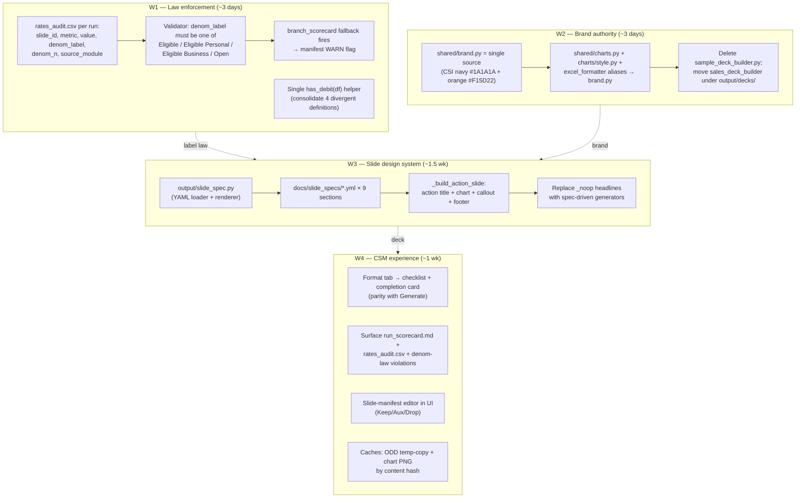

# Velocity Pipeline — Accuracy, Brand, Slides, CSM UX (reconciled)

**Status:** Proposal · supersedes `2026-06-04-velocity-pipeline-accuracy-and-design.md` (remote ultraplan output)
**Branches off:** `main`
**Anchor docs:** `CLAUDE.md` (UI-first rule) · memory `project_denominator_framework.md` (4-layer law) · `SLIDE_DESIGN.md`

---

## Why this supersedes the ultraplan output

The remote ultraplan was working off `docs/audits/2026-04-17-data-quality-audit.md` (49 days old). Two of its three diagnoses are stale or inverted:

| Ultraplan claim | Current code reality |
|---|---|
| "Reg E denominator is `eligible_personal ∩ has_debit` — fix by switching to `open_personal`" | `analytics/rege/_helpers.py:135-183` already reads `eligible_personal` with an explicit comment citing the 4-layer framework. No `∩ has_debit` filter remains in the denominator. **Already fixed.** |
| "`insights/branch_scorecard.py` reimplements rates against raw `ctx.data` — fix by reading `ctx.results`" | `branch_scorecard.py:46-53` already has a primary path that pulls from `ctx.results`; `_recompute_from_raw` at line 119 is a documented *fallback* that uses `eligible_data` (not raw `ctx.data`). **Already partially fixed.** Remaining work: make the fallback observable (log + manifest WARN flag when it fires) so we know if it's silently masking missing upstream results. |
| "Pipeline reports ~30% DCTR vs notebook's ~80% — fix by broadening the denominator to `open_accounts`" | `pipeline/steps/subsets.py:97-99` literally comments *"DCTR goes from 80% to 30% if closed are included"*. The 4-layer law (memory `project_denominator_framework.md`) says **Eligible is the primary default; Open is reference framing only**. The pipeline's 30% is correct. The notebook's 80% is the Open-based reference. The fix is **labeling**, not math. |

What survives from the ultraplan:
- The brand/color authority problem (Wave 2) — independent of the math, real, ~65 files touched today.
- The slide design system gap (Wave 3) — ~40% headlines are `_noop`; only 2 of 9 sections have specs; three deck-builder files where one belongs.
- The CSM UX gaps (Wave 4) — Format tab has no checklist parity, `run_scorecard.md` is written but never surfaced, slide manifest is edited in Excel, no caching of the ODD temp-copy or chart PNGs.
- The `rates_audit.csv` per-run artifact (Wave 1) — but **re-purposed** to enforce the 4-layer law (every rate must label exactly one of the four denominators), not to chase notebook parity.

---

## Shape of the change



Four PRs against `main`, one per wave, in order. Each one is independently shippable.

---

## Wave 1 — Law enforcement (NOT denominator surgery) — ~3 days

### What this is not

This wave does **not** swap denominators in DCTR, Value, Insights, or anywhere else. The 4-layer framework is already encoded in `subsets.py`. The numbers the pipeline produces today are correct per the law.

### What this is

Make the law machine-checkable, so future drift gets caught. Plus two genuine bugs the ultraplan correctly identified that survive the stale audit.

### 1.1 Per-run `rates_audit.csv`

New file: `01_Analysis/00-Scripts/pipeline/steps/audit.py`. Runs at the end of `step_generate` (hook at `pipeline/steps/generate.py:118`). Writes `rates_audit.csv` next to `run_manifest.json`:

```
slide_id, metric, value, denominator_label, denominator_n, source_module, framework_compliant
```

Every rate the deck ships gets one row. `denominator_label` must be exactly one of:

- `Eligible`
- `Eligible Personal`
- `Eligible Business`
- `Open` (reference framing only — flagged if used as primary denominator)

`framework_compliant` is the boolean result of the validator (see 1.2).

### 1.2 Denominator-law validator

`pipeline/steps/audit.py:validate_against_law()` walks the rates_audit and:

- Rejects any `denominator_label` not in the four-layer set.
- Flags any row where `denominator_label == "Open"` and the slide_id is not on the explicit reference-framing allowlist (currently: `DCTR-2` "Open vs Eligible" methodology slide only).
- Writes violations as `AnomalyFlag(level=WARN)` on the run manifest via `manifest.flag()` (`pipeline/manifest.py:242` already provides the API).
- Returns a count surfaced in `run_scorecard.md` as "Denominator law: N violations" (zero = ship, ≥1 = investigate).

Each analytics module reports its rate's denominator label by stamping it in its `AnalysisResult.insights` dict — a new contract field `denominator_label`. Modules without the field emit `framework_compliant=False` until they're updated; this is the lever for incremental rollout.

### 1.3 `branch_scorecard` fallback observability

`analytics/insights/branch_scorecard.py:53`. When `_recompute_from_raw` fires (because upstream `ctx.results` are missing), today it silently returns. Add:

- `logger.warning("branch_scorecard fell back to eligible_data recompute (upstream results missing)")`
- `ctx.manifest.flag(section="insights", level="WARN", message="branch_scorecard fallback fired")` if `ctx.manifest` is not None.

Three lines. Doesn't change the math — makes the silent path noisy.

### 1.4 Standardize `has_debit`

New file: `01_Analysis/00-Scripts/shared/debit.py`:

```python
def has_debit(df: pd.DataFrame, col: str = "Debit Card") -> pd.Series:
    """Truthy mask covering strings ('Y','Yes','True'), booleans, and ints."""
```

Replace the four divergent definitions at:
- `analytics/dctr/_helpers.py:42`
- `analytics/insights/dormant.py:62`
- `analytics/insights/branch_scorecard.py:71`
- `analytics/mailer/reach.py:91`

Verify: run a representative client; the debit-holder count should be identical across all four modules in `run_manifest.json`.

### 1.5 Tighten `_safe` silent-drop wrappers

`analytics/dctr/penetration.py:37-50`, `analytics/rege/status.py:23-36`, `analytics/insights/_data.py:13-26`. On `success=False`, escalate to top-level WARN and stamp `AnomalyFlag(level=WARN)`. Same `manifest.flag()` API.

### 1.6 Verify

```bash
cd 01_Analysis/00-Scripts && python -m pytest tests/ -q
python run.py --month 2026.04 --csm James --client 1615
cat 01_Analysis/01_Completed_Analysis/James*/2026.04/1615/rates_audit.csv
cat 01_Analysis/01_Completed_Analysis/James*/2026.04/1615/run_manifest.json | jq '.anomaly_flags'
```

Expectations:
- `rates_audit.csv` exists, one row per shipped rate, `denominator_label` populated.
- First-run violation count > 0 (most modules don't stamp `denominator_label` yet — that's the punch list for follow-up commits, not a Wave 1 blocker).
- `branch_scorecard fallback fired` shows up in anomaly flags when relevant; absent when not.
- `has_debit` consolidated count identical across the four modules.

---

## Wave 2 — Brand authority — ~3 days

Goal: one file defines the brand, every chart / Excel / PPTX / UI surface reads from it.

### 2.1 New `01_Analysis/00-Scripts/shared/brand.py`

```python
BRAND = {
    "navy":          "#1A1A1A",   # canonical (README + UI header)
    "navy_soft":     "#2A2A2A",
    "accent":        "#F15D22",   # CSI orange
    "accent_light":  "#fef0e8",
    "accent_dark":   "#d14e1a",
    "positive":      "#2A8B3E",
    "negative":      "#C73E1D",
    "warning":       "#F39C12",
    "neutral":       "#8B95A2",
    "muted":         "#B0B0B0",
    "light_gray":    "#E8E8E8",
    "bg":            "#FFFFFF",
    "text":          "#222222",
    "text_muted":    "#777777",
}
FONTS = {"title": "Montserrat", "body": "Montserrat", "mono": "Space Mono"}
SIZES = {
    "action_title": 24, "subtitle": 16, "body": 12,
    "callout_hero": 44, "callout_label": 14, "axis": 11, "footnote": 9,
}
```

### 2.2 Demote existing color modules to aliases

- `shared/charts.py` `COLORS` → re-export from `brand.BRAND`. Dict literal API unchanged.
- `charts/style.py` legacy semantic aliases (`PERSONAL`, `BUSINESS`, `HISTORICAL`, `TTM`, `TEAL`, etc.) → resolve to `brand.BRAND` values. ~65 analytics files unchanged; they just get the right hexes.
- `output/excel_formatter.py:15,24,26,102,113` and `shared/excel.py:19,56,101` → `brand.BRAND["navy"]`.
- `output/deck_builder.py:259` `RGBColor(0x1B, 0x36, 0x5D)` → derived from `brand.BRAND["navy"]`.
- `05_UI/index.html:18-26` CSS vars — verify against actual file (UI memo says `#1A1A1A`, but actual current value may differ). Update `05_UI/UI-OVERVIEW.md:15` so docs match reality.

### 2.3 Update governing docs

- `SLIDE_DESIGN.md §5` color table → restate canonical CSI navy + accent.
- `SLIDE_MAPPING.md "Color System"` section → same.
- `docs/slide_specs/dctr.md` and `rege.md` color references → align.

### 2.4 Collapse duplicate deck builders

- Keep `01_Analysis/00-Scripts/output/deck_builder.py` (production path).
- Delete `output/sample_deck_builder.py` (verify zero callers via `grep -rn sample_deck_builder` before delete).
- Move `output/sales_deck_builder.py` → `output/decks/sales.py`; import shared helpers (`_add_fitted_picture` etc.) from `deck_builder` rather than reimplementing.

### 2.5 Verify

```bash
grep -rE '#(1B365D|1E3D59|00274C|2E4057)' 01_Analysis/00-Scripts/ 05_UI/ 02_Presentations/
# Expected: empty.
grep -rn 'sample_deck_builder\|sales_deck_builder' 01_Analysis/
# Expected: only the new output/decks/sales.py path.
python -m pytest tests/ -q
python run.py --month 2026.04 --csm James --client 1615
```

Open the deck; every navy element should be the same hex. Open the PPTX in `02_Presentations/James*/2026.04/1615/` and eyeball.

---

## Wave 3 — Slide design system executed — ~1.5 wk

Goal: every main-deck slide follows `SLIDE_DESIGN.md` anatomy — action title (with a number in it), one chart, one callout, footer band. ~17 main-deck slides per the McKinsey-25 rule; everything else routes to the appendix via the existing `SLIDE_MANIFEST.xlsx` `A`-marker pathway.

### 3.1 YAML spec format

Move `docs/slide_specs/*.md` to `docs/slide_specs/*.yml`. Spec is data, not prose:

```yaml
DCTR-MAIN-1:
  layout: TWO_CONTENT
  components: [A7.6a, DCTR-7]
  action_title: "L12M DCTR of {l12m_rate:.0%} {direction} historical by {gap_pp:.0f}pp; {top_n} branches drive {contribution:.0%} of the gap"
  inputs:
    l12m_rate: ctx.results.dctr_3.insights.dctr
    overall_rate: ctx.results.dctr_1.insights.overall_dctr
    gap_pp: "{l12m_rate - overall_rate}*100"
    direction: "trails if gap_pp<0 else beats"
    top_n: 3
    contribution: ctx.results.dctr_7.gap_contributors.share_top3
  denominator_label: Eligible      # <-- ties Wave 1 law to the slide
  callout:
    hero: "${delta_revenue:,.1f}M"
    sub: "annual debit interchange uplift"
    tertiary: "Closing the gap at {b1}, {b2}, {b3} to portfolio-median DCTR"
  footer:
    source: "Source: {client_name} ODD, {month} | N = {eligible_count:,}"
```

The `denominator_label` field links W1 to W3: the validator can confirm that the spec's declared denominator matches what the source module stamped.

### 3.2 `output/slide_spec.py` — loader + renderer

```python
def load_specs(section: str) -> dict[str, SlideSpec]:
    """Parse docs/slide_specs/<section>.yml into typed SlideSpec objects."""

def render_spec(spec: SlideSpec, ctx_results: dict, client: ClientInfo) -> SlideContent:
    """Resolve inputs, format the action title, build the callout, return SlideContent."""
```

Wire into `deck_builder._result_to_slide` (line 1547). When a spec exists for `slide_id`, render from it; otherwise fall back to today's behavior. Zero-risk rollout: slide-by-slide.

### 3.3 Author 9 section specs

| Section | Main slides | Status |
|---|---|---|
| `overview.yml` | 1 | already drafted as A1 |
| `dctr.yml` | 3 | already drafted in `dctr.md`; convert MD → YAML |
| `rege.yml` | 2 | already drafted; relabel for `Eligible Personal` |
| `attrition.yml` | 2 (A9.1 rate, A9.11 revenue impact) | new |
| `value.yml` | 1 (A11.1 hero + waterfall) | new |
| `mailer.yml` | 2 (most recent month + aggregate) | new |
| `insights.yml` | 3 (S1 revenue gap, S6 opportunity map, S8 action plan) | new |
| `txn_exec.yml` | 1 (executive scorecard) | new |
| `competition.yml` | 2 (threat quadrant + wallet share) | new |

Total: ~17 main-deck slides. Everything else is `A`-routed to `*_aux_deck.pptx` via the existing manifest pathway in `output/manifest.py`.

### 3.4 `_build_action_slide` in `deck_builder`

Replace `_build_screenshot_slide` (currently around line 503 — verify in current state). Components, top-down:
- Action title block: 24pt bold navy, 2-line max, left-aligned.
- Chart region: fitted PNG.
- Callout box: bottom-overlay, accent border, hero number 44pt bold accent, two lines of subtext.
- Footer band: 9pt italic source line + 8pt confidentiality.

Reuse `chart_annotations.py` callout patterns for the callout box geometry.

### 3.5 Headline coverage

`output/headlines.py:550-637` has 60+ entries, many `_noop`. For every slide the spec covers, replace `_noop` with a spec-driven generator (the spec's `action_title` template). Slides without specs stay on analytics titles — fine for the appendix.

### 3.6 Chart-level work called out by the existing spec docs

These are the genuine remaining items from `docs/slide_specs/dctr.md:194-204` and `docs/deck/wave1-implementation.md`:

- `dctr/trends.py` (A7.6a): muted-gray volume columns behind teal rate line; dashed historical reference line.
- `dctr/branches.py` (DCTR-7): vertical combo, historical + L12M lines, three focus branches highlighted.
- `dctr/funnel.py`: add `biggest_drop_stage` + `drop_pct` to insights.
- `value/analysis.py` (A11.1): expose `waterfall_stages` list as structured data on `ctx.results["value_1"]`.
- Drop zero-volume categories before plotting (`SLIDE_DESIGN.md §6.2` rule, not enforced today).

### 3.7 Verify

```bash
python -m pytest tests/ -q
python run.py --month 2026.04 --csm James --client 1615 --product combined
# Open the deck. Every main-deck slide should have:
#   1. Action-title sentence with a number in it
#   2. Callout box with a hero number visible at distance
#   3. Footer band with source + confidentiality
#   4. Brand colors from Wave 2
```

Sanity check: run two adjacent clients side-by-side. The action titles should be different sentences with different numbers. If they're the same, the spec is mis-bound to `ctx.results`.

---

## Wave 4 — CSM experience — ~1 wk

Goal: shave runtime; surface diagnostics that exist but the operator never sees; give them deck control without leaving the UI.

Per `CLAUDE.md` UI-first rule: every new capability ships as a button/panel/tab in `05_UI/index.html` backed by an endpoint in `05_UI/app.py`. No CLI-only additions.

### 4.1 Format tab → checklist parity with Generate

`05_UI/UI-OVERVIEW.md:58` calls this out as a known follow-up. Replicate the 5-stage checklist + completion-card pattern from Generate (`#gRunView`, `#gDoneView`) into Format. Backend already returns a `run_id`; this is frontend work against the same `_classifyStage` parser.

### 4.2 Surface scorecard + rates audit + law violations

After a run completes, fetch `run_scorecard.md`, `rates_audit.csv`, and the anomaly flags from `run_manifest.json`. Render in the completion card:

- "Run Quality" panel: manifest verdict ("Ship" / "Investigate before shipping").
- "Anomaly Flags" collapsible: `branch_scorecard fallback fired`, `_safe wrappers returned success=False`, etc.
- "Denominator Law" panel: violation count + click-through to `rates_audit.csv` filtered to non-compliant rows.

Backend: extend `GET /api/outputs/{csm}/{month}/{client_id}` to include `scorecard_url`, `rates_audit_url`, `flag_count`, `denom_violation_count`. Frontend: new section in `#gDoneView`.

### 4.3 Slide-manifest editor in the UI

Today CSMs edit `SLIDE_MANIFEST.xlsx` in Excel. Add a "Deck Shape" panel on the Results tab:

- For the selected client/period, load `run_manifest.json` (slide IDs + titles) + current `SLIDE_MANIFEST.xlsx` decisions.
- Sortable grid: `slide_id, title, current_decision (Y/A/N/blank), section`.
- Toggle inline `Y → A → N → blank`.
- "Save" → `POST /api/manifest` writes back to `SLIDE_MANIFEST.xlsx`.
- "Rebuild deck" → deck-only rebuild (no re-analysis) using new decisions.

Data path is already there; this is editor + write endpoint.

### 4.4 Caching for speed

Two known bottlenecks:

- **ODD temp-copy cache.** `pipeline/steps/load.py:178-198` copies the `.xlsx` to a temp file before reading (network-drive openpyxl latency workaround). Cache the temp copy keyed by `(source_path, mtime, size)`. Second run of the same client in one session skips the copy.
- **Chart PNG cache.** Re-rendered every run. Add a content hash (input DataFrame fingerprint + style hash) at `chart_figure` save time. If the PNG with the same hash exists in `charts_dir`, reuse it. Hook: `shared/charts.py:36` `save_chart_png`.

Expected effect on a hot second run: ~25 min → ~10–15 min. Cold runs unchanged.

### 4.5 Verify

Run a second-time `python run.py --month 2026.04 --csm James --client 1615` and confirm:
- Format tab shows the checklist + completion card.
- Completion card shows scorecard verdict, anomaly flags, denominator-law violation count.
- Editing a slide's `Keep?` in the new UI panel + Rebuild deck produces a new PPTX with that slide removed — no re-analysis.
- Second-run wall time is materially lower than first run; cache hit lines visible in the log.

---

## Files this plan touches

| Wave | Files |
|---|---|
| W1 | new `pipeline/steps/audit.py`, new `shared/debit.py`, `pipeline/steps/generate.py`, `analytics/insights/branch_scorecard.py`, `analytics/dctr/_helpers.py`, `analytics/insights/dormant.py`, `analytics/mailer/reach.py`, `analytics/dctr/penetration.py`, `analytics/rege/status.py`, `analytics/insights/_data.py`, each `AnalysisResult` insights producer (stamp `denominator_label`) |
| W2 | new `shared/brand.py`, `shared/charts.py`, `charts/style.py`, `output/excel_formatter.py`, `shared/excel.py`, `output/deck_builder.py`, `output/sales_deck_builder.py` (move), delete `output/sample_deck_builder.py`, `SLIDE_DESIGN.md`, `SLIDE_MAPPING.md`, `05_UI/UI-OVERVIEW.md` |
| W3 | new `output/slide_spec.py`, new `docs/slide_specs/*.yml` (9 files), `output/deck_builder.py` (`_build_action_slide` + `_result_to_slide`), `output/headlines.py`, `analytics/dctr/trends.py`, `analytics/dctr/branches.py`, `analytics/dctr/funnel.py`, `analytics/value/analysis.py` |
| W4 | `05_UI/index.html`, `05_UI/app.py` (new `/api/manifest`, extended `/api/outputs`), `pipeline/steps/load.py` (ODD cache), `shared/charts.py` (chart cache) |

---

## Explicit non-goals

- Does **not** broaden any denominator. The 4-layer law stands; W1 enforces it, doesn't relitigate it.
- Does **not** redesign all 339 TXN slides. W3 covers ~17 main-deck slides per the McKinsey-25 rule; everything else stays in the appendix.
- Does **not** address competition section axis-scaling bugs (`12_bubble_chart`, `13_threat_quadrant`, `26_spend_scatter`, `28_spend_vs_frequency`) — separate per-chart pass.
- Does **not** change Step 1 formatting (`00_Formatting/run.py`). Out of scope.
- Does **not** wire CI. `rates_audit.csv` is the foundation for future CI; GitHub Actions hookup is a follow-up.
- Does **not** rename operator-facing modules (`ars`, `txn`, `dep`). Name churn for no operator benefit.

---

## Open questions before W1 starts

1. **Slide-spec denominator_label as soft or hard contract?** Soft = warn-only on mismatch with module stamp; hard = block deck render. Recommend soft for the first three runs, then promote to hard once the per-module stamps are populated.
2. **Where does `rates_audit.csv` live in the UI?** Recommend: completion card "Run Quality" panel only (not its own tab) — keeps the UI focused on the loop the CSM already knows.
3. **Reference-framing allowlist for `Open` denominator.** Currently the only slide the framework permits is `DCTR-2` "Open vs Eligible." Verify no other slide legitimately needs Open before W1 ships the validator.
