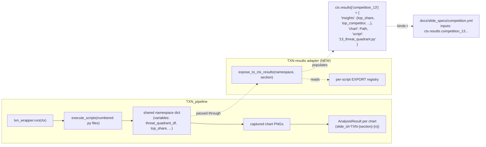

# TXN-results adapter — design

**Status:** Design proposal · drives the implementation of `competition.yml` + `txn_exec.yml` slide specs
**Anchor docs:** `docs/slide_specs/_TEMPLATE.yml` · `01_Analysis/00-Scripts/output/slide_spec.py` · `01_Analysis/00-Scripts/analytics/txn_wrapper.py`

---

## Problem

The slide-spec system (W3, PR #163) renders action titles, callouts, and footer bands from a YAML spec whose `inputs:` block resolves dotted paths against `ctx.results`. ARS modules write to `ctx.results` in the pattern that the renderer expects:

```python
# analytics/dctr/penetration.py
ctx.results["dctr_1"] = {
    "yearly": yearly,
    "decade": decade,
    "insights": {"overall_dctr": 0.31, "total_accounts": 12345},
}
```

Then `docs/slide_specs/dctr.yml` binds:

```yaml
inputs:
  l12m_rate: ctx.results.dctr_3.insights.dctr
```

TXN modules don't follow this pattern. They are numbered scripts (`01_competitor_config.py` ... `70_banking_vs_ecosystems.py`) run by `analytics/txn_wrapper.py` inside a **shared namespace** (one big `dict` passed between scripts as both globals and locals). Computed values live as bare variables in that namespace — `threat_quadrant_df`, `top_competitors`, `wallet_share_pct` — never marshaled into `ctx.results`.

`txn_wrapper.py:387` builds an `AnalysisResult` per captured chart with an auto-generated `slide_id` like `TXN-competition-12`. The result has the chart path but no `kpis` and no upstream insights dict. Without those, a slide spec can't bind `inputs: ctx.results.competition_12.insights.threat_share` — there's nothing on the other end of the path.

**Symptom:** every TXN slide falls through `_result_to_slide` to the legacy screenshot pathway. No action title, no callout, no footer band — even after PR #163.

---

## Goal

Let a `docs/slide_specs/<section>.yml` spec bind to TXN-script outputs the same way it binds to ARS module outputs. Specifically:

```yaml
COMPETITION-MAIN-THREAT-QUADRANT:
  components: [13_threat_quadrant]
  action_title: "{top_competitor} captures {top_share:.0%} of out-of-network spend"
  inputs:
    top_competitor: ctx.results.competition_13.insights.top_competitor
    top_share:      ctx.results.competition_13.insights.top_share
  denominator_label: Eligible
  callout: { hero: "${gap_dollars:,.0f}", ... }
  footer:  { source: "..." }
```

Must work without operator intervention — no Excel mapping file, no per-client overrides.

---

## Shape of the change



Two new pieces:

1. A **per-script export registry** that declares which variables in a TXN script's namespace are part of its public surface. Keyed by `(section, script_number)`, valued as a list of variable names + (optionally) a flattening function.
2. An **adapter function** that runs after each TXN script's namespace settles, reads the declared exports, and writes them to `ctx.results[f"{section}_{script_number}"]`.

The adapter runs inside `txn_wrapper._execute_scripts` after each `exec(compile(code, ...), namespace)` call.

---

## Step-by-step implementation

### 1. Export registry — `analytics/txn_exports.py`

```python
"""Declarations of which variables each TXN script exposes to ctx.results.

Each entry maps a (section, script_number) tuple to a list of variable names
to copy from the shared namespace into ctx.results[f"{section}_{n}"]["insights"].

Schema:
    SECTION_EXPORTS: dict[tuple[str, int], dict[str, Any]] = {
        (section_name, script_number): {
            "insights": [var_name, var_name, ...],   # bare scalars / strings
            "tables": [var_name, ...],               # DataFrames
            "charts": [var_name, ...],               # Path objects
        },
    }

Variables that don't exist in the namespace are silently skipped -- adapter
logs the miss at DEBUG. This lets a partially-implemented export survive
script failures.
"""

SECTION_EXPORTS: dict[tuple[str, int], dict[str, list[str]]] = {
    # competition section
    ("competition", 13): {  # 13_threat_quadrant.py
        "insights": [
            "top_competitor",        # str: name of top out-of-network spender
            "top_share",             # float: 0..1 share of out-of-network
            "second_competitor",
            "second_share",
            "threat_count",          # int: total threats above threshold
        ],
        "tables": ["threat_quadrant_df"],
    },
    ("competition", 24): {  # 24_segment_heatmap.py (wallet share)
        "insights": [
            "wallet_share_pct",      # float: 0..1 share of total wallet
            "wallet_gap_dollars",    # float: estimated leakage
        ],
        "tables": ["segment_heatmap_df"],
    },

    # txn_exec section (executive scorecard + action roadmap)
    ("executive", 1): {  # 01_kpi_scorecard.py
        "insights": [
            "total_active_accounts",
            "total_swipes",
            "total_spend",
            "avg_spend_per_account",
            "interchange_revenue",
        ],
    },
    ("executive", 5): {  # 05_action_roadmap.py
        "insights": [
            "n_actions",
            "total_impact",
            "top_action",
        ],
    },

    # ... extend per section as needed
}
```

Keep this registry **next to** `txn_wrapper.py` (under `01_Analysis/00-Scripts/analytics/`). It's project state, not infrastructure.

### 2. Adapter function — `txn_wrapper.expose_to_ctx_results`

Add to `txn_wrapper.py`:

```python
from ars_analysis.analytics.txn_exports import SECTION_EXPORTS


def expose_to_ctx_results(
    ctx: PipelineContext,
    namespace: dict[str, Any],
    section: str,
    script_number: int,
    script_path: Path,
) -> None:
    """Copy declared exports from `namespace` into ctx.results.

    Called after each TXN script finishes execution. Looks up the
    (section, script_number) tuple in SECTION_EXPORTS; for each variable
    name listed, reads it from the namespace and stamps it on ctx.results.
    Silently skips variables that aren't in the namespace -- they may not
    exist if the script failed partway through.
    """
    spec = SECTION_EXPORTS.get((section, script_number))
    if spec is None:
        return  # No declared exports for this script -- not an error.

    key = f"{section}_{script_number}"
    bucket = ctx.results.setdefault(key, {})
    bucket.setdefault("insights", {})
    bucket.setdefault("tables", {})
    bucket["script"] = script_path.name

    for var in spec.get("insights", []):
        if var in namespace:
            bucket["insights"][var] = namespace[var]
        else:
            logger.debug(
                "TXN export miss: {section}/{script} expected {var} not in namespace",
                section=section, script=script_number, var=var,
            )

    for var in spec.get("tables", []):
        if var in namespace:
            bucket["tables"][var] = namespace[var]
```

Wire the call into `_execute_scripts` after the existing `exec()` call:

```python
# After: exec(compile(code, str(script_path), "exec"), namespace)
# Add:
script_number = _extract_script_number(script_path.name)   # 01_foo.py -> 1
if script_number is not None:
    expose_to_ctx_results(ctx, namespace, section_name, script_number, script_path)
```

Plus a tiny helper:

```python
def _extract_script_number(filename: str) -> int | None:
    """01_foo.py -> 1; 70_banking_vs_ecosystems.py -> 70; unprefixed -> None."""
    parts = filename.split("_", 1)
    try:
        return int(parts[0])
    except (ValueError, IndexError):
        return None
```

### 3. AnalysisResult slide_id rewrite

Right now `txn_wrapper.py:386` builds slide IDs like `TXN-competition-12`, indexed by chart order within a section. That's stable enough for the deck builder but doesn't align with the export key (`competition_13` for script 13).

Decide one of:

a. **Spec author uses the chart-index naming** (`TXN-competition-12`) and the spec inputs reference `ctx.results.competition_<script_number>` via an alias map. Operator never sees the discrepancy. *Cleanest for the spec author.*

b. **Slide IDs become `competition_13_threat_quadrant`** (script-number-prefixed). Spec author binds against the same key. *Cleanest for the renderer; breaks compatibility with existing deck headlines that key on `TXN-competition-N`.*

**Recommended:** (a). Don't touch the existing slide_id contract; have the spec system handle the indirection via `_spec_section_for` and a new `_spec_key_for(slide_id)` helper that maps `TXN-competition-12` -> the `competition_13` key by walking the chart-order in `AnalysisResult.metadata["script_number"]` (which the adapter also stamps).

### 4. Author the specs

With the adapter live, write `docs/slide_specs/competition.yml`:

```yaml
COMPETITION-MAIN-THREAT-QUADRANT:
  layout: TWO_CONTENT
  components: [13_threat_quadrant]
  action_title: "{top_competitor} captures {top_share:.0%} of out-of-network spend; {threat_count} competitors above threshold"
  inputs:
    top_competitor: ctx.results.competition_13.insights.top_competitor
    top_share:      ctx.results.competition_13.insights.top_share
    threat_count:   ctx.results.competition_13.insights.threat_count
  denominator_label: Eligible
  callout:
    hero: "{top_share:.0%}"
    sub: "share captured by top competitor"
    tertiary: "{threat_count} competitors above the threshold are draining card spend"
  footer:
    source: "Source: {client_name} TXN, {month} | competition module"

COMPETITION-MAIN-WALLET-SHARE:
  layout: TWO_CONTENT
  components: [24_segment_heatmap]
  action_title: "Estimated ${wallet_gap_dollars:,.0f} in addressable card-spend leakage"
  inputs:
    wallet_share_pct:    ctx.results.competition_24.insights.wallet_share_pct
    wallet_gap_dollars:  ctx.results.competition_24.insights.wallet_gap_dollars
  denominator_label: Eligible
  callout:
    hero: "${wallet_gap_dollars:,.0f}"
    sub: "annual leakage opportunity"
    tertiary: "Current wallet share: {wallet_share_pct:.0%}"
  footer:
    source: "Source: {client_name} TXN, {month} | wallet-share derivation"
```

And `docs/slide_specs/txn_exec.yml`:

```yaml
TXN-EXEC-MAIN-1:
  layout: TWO_CONTENT
  components: [01_kpi_scorecard]
  action_title: "{total_active_accounts:,} active accounts; ${total_spend:,.0f} swiped; ${interchange_revenue:,.0f} interchange"
  inputs:
    total_active_accounts: ctx.results.executive_1.insights.total_active_accounts
    total_spend:           ctx.results.executive_1.insights.total_spend
    total_swipes:          ctx.results.executive_1.insights.total_swipes
    avg_spend_per_account: ctx.results.executive_1.insights.avg_spend_per_account
    interchange_revenue:   ctx.results.executive_1.insights.interchange_revenue
  denominator_label: Eligible
  callout:
    hero: "${interchange_revenue:,.0f}"
    sub: "interchange revenue captured"
    tertiary: "Avg ${avg_spend_per_account:,.0f} spend per account"
  footer:
    source: "Source: {client_name} TXN, {month} | executive scorecard"

TXN-EXEC-MAIN-2:
  layout: TWO_CONTENT
  components: [05_action_roadmap]
  action_title: "{n_actions} prioritized initiatives totaling ${total_impact:,.0f} in modeled annual impact"
  inputs:
    n_actions:    ctx.results.executive_5.insights.n_actions
    total_impact: ctx.results.executive_5.insights.total_impact
    top_action:   ctx.results.executive_5.insights.top_action
  denominator_label: Eligible
  callout:
    hero: "${total_impact:,.0f}"
    sub: "modeled annual impact"
    tertiary: "Lead with: {top_action}"
  footer:
    source: "Source: {client_name} TXN, {month} | initiatives from executive roadmap"
```

---

## What this does **not** do

- **Doesn't unify the AnalysisResult shape.** TXN charts still go through `slide_id=TXN-{section}-{n}` because changing that breaks the legacy deck builder. The adapter sidesteps the slide_id question by stamping `ctx.results[f"{section}_{script_number}"]` independently.
- **Doesn't make TXN scripts pure functions.** Scripts still execute in a shared namespace with all the cell-passing-state behavior; the adapter just *reads* declared variables after the script settles.
- **Doesn't fingerprint TXN exports for the chart cache.** Cache adoption is per chart-call-site, not per script. TXN chart caching needs its own adoption pass.
- **Doesn't address Plotly-vs-matplotlib.** TXN sections that emit Plotly charts (most of competition) save to disk via `pio.write_image`; the cache adapter pattern from `docs/chart-cache-adoption.md` is matplotlib-flavored. A small Plotly-aware shim would be a follow-up.

---

## Open questions

1. **Where does the export registry live?** Recommendation: `01_Analysis/00-Scripts/analytics/txn_exports.py`. It's project state (operator should edit it as deck shape evolves), not infrastructure. Co-locating with `txn_wrapper.py` makes it discoverable.
2. **Do we version-pin the script numbers?** Renaming `13_threat_quadrant.py` -> `13_threat_landscape.py` keeps the export key (`competition_13`) but rearranging numbers (inserting `12.5_*`) doesn't. Recommend: **forbid renumbering** in the conventions doc; rename only.
3. **Failure mode when a script exports nothing.** If `competition_13` produces no `top_competitor` value (data sparse), the spec falls back to the lenient `{top_competitor}` placeholder per `output/slide_spec._format` warning behavior. The slide renders with the unfilled placeholder visible; the audit step surfaces a `render_warning`. **Same behavior as ARS today** — no change needed.

---

## Verification (after implementation)

```bash
cd 01_Analysis/00-Scripts && python -m pytest tests/ -q
python run.py --month 2026.04 --csm James --client 1615 --product txn
# Open the TXN deck; main-deck competition + exec slides should now have:
#   1. Action-title sentences with numbers ({top_competitor}, ${total_spend}, etc.)
#   2. Callout boxes
#   3. Footer bands
# rates_audit.csv (Wave 1) picks up the new competition_13 / executive_1 rates.
```

If `rates_audit.csv` shows `denominator_label='Eligible'` on the new TXN slides but `framework_compliant=False`, the spec's `denominator_label:` is missing — re-author.

---

## Estimated effort

- Adapter + registry skeleton + tests: **~2 hours**
- Per-section export declarations (competition first, then executive): **~3 hours**, mostly reading TXN scripts to find the right variable names
- Spec authoring (after adapter validates): **~1 hour**
- Plotly-aware chart cache shim (separate PR): **~2 hours**

Total: **~1 working day** to land both spec files end-to-end. Largest risk is variable naming drift inside TXN scripts — the export registry has to track refactors.
